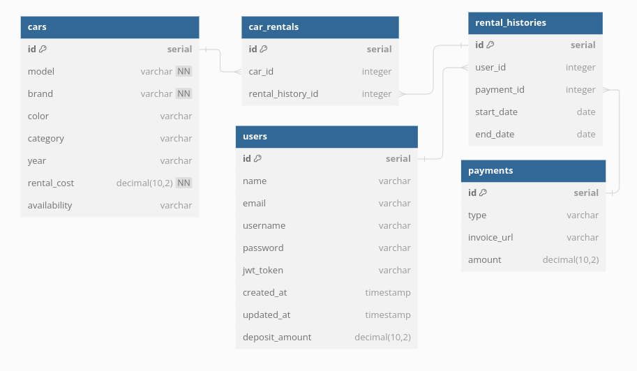

## Kururen API

### Project Description

Car Rental API

### ERD

### Folder Structure
- api
  - handler
    - cars
    - rentals
    - users
  - presentation
    - cars
    - rentals
    - users
  - middlewares
  - routes
    - v1
- entity
- config
- pkg
  - jwt
  - response
  - xendit
- repository
  - cars
  - rentals
  - users
- migrations

### Tech Stack
- Echo
- PostgreSQL
- Gorm
- Testify
- Mockery
- Logrus
- Swaggo
- JWT
- Heroku
- Docker

### How to run
1. create copy `.env.example` into `.env` and fill in the project config
2. prepare your postgres server and run `make migration`
3. run `make run` to build and run the server
